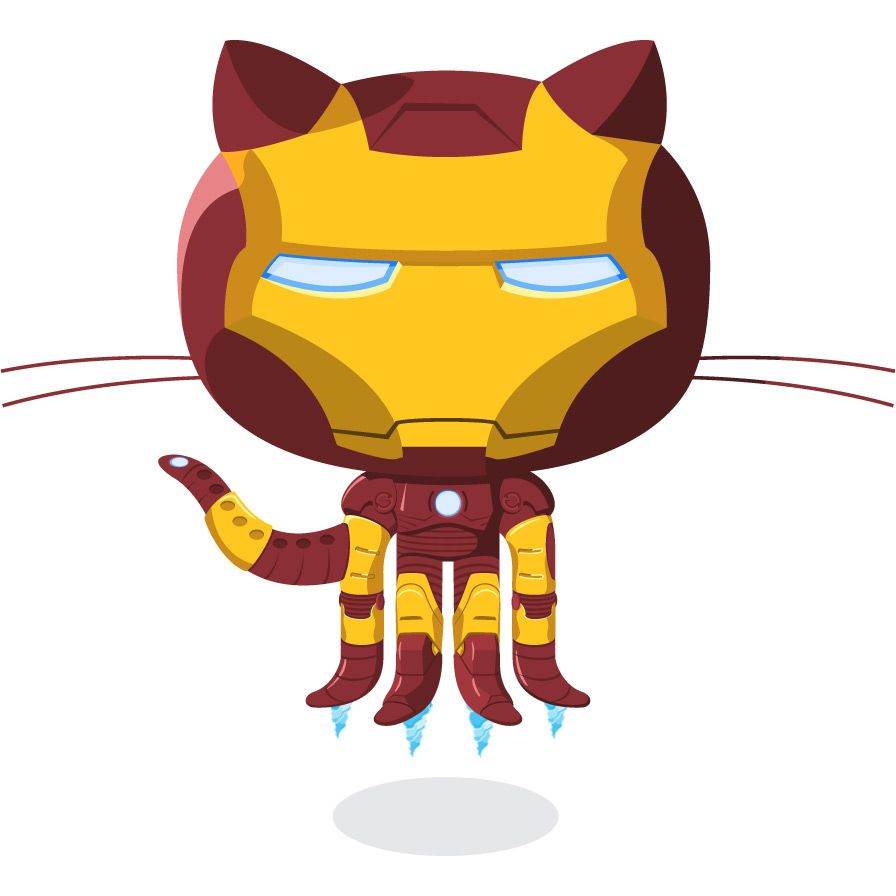

## Hi, I'm Vignesh 👋

  

 

✨ I'm passionate about <strong>development</strong> and always striving to create <strong>scalable</strong> and <strong>efficient</strong> solutions. I thrive on building products that not only meet user needs but also <strong>elevate their experience</strong>. With a focus on <strong>continuous learning</strong>, I explore new technologies and techniques to improve my work and stay ahead of the curve. My expertise lies in developing <strong>secure</strong> and <strong>high-performance web applications</strong> that deliver <strong>innovative solutions</strong>. I'm excited about crafting technology that pushes boundaries and makes a real impact. 

- 💻 <strong>Passionate about development</strong>, always working towards crafting better solutions.
- 🚀 <strong>Focused on optimizing performance</strong> and creating seamless user experiences.
- 🔍 Constantly <strong>exploring new technologies</strong> to stay innovative and ahead of the curve.
- 💡 Eager to <strong>collaborate</strong> on exciting and <strong>impactful projects</strong> that make a difference.

  
